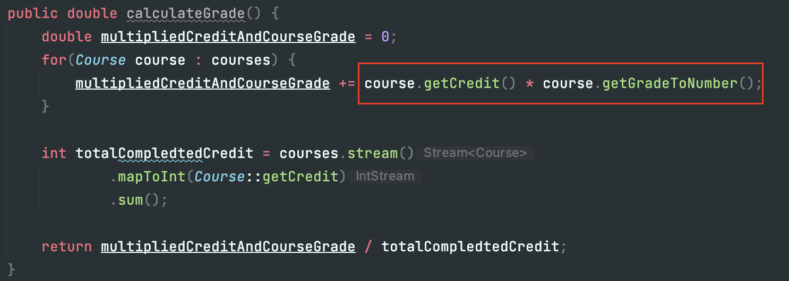
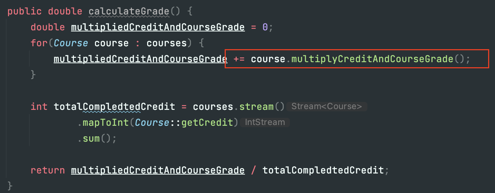
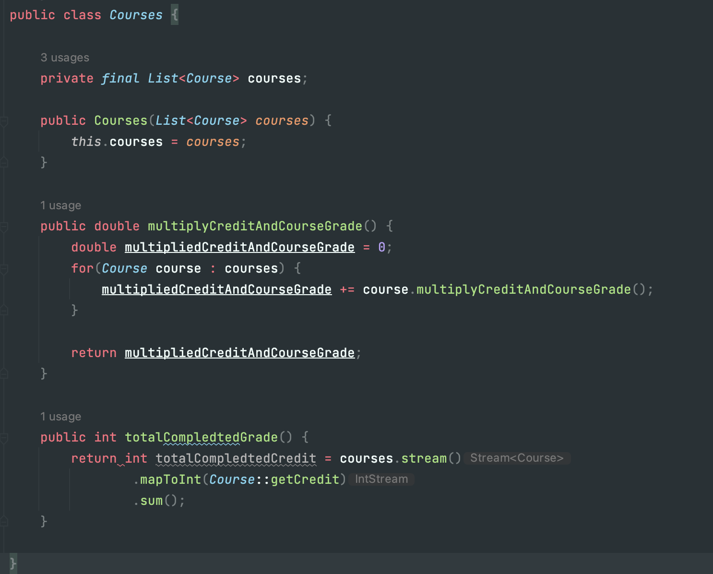
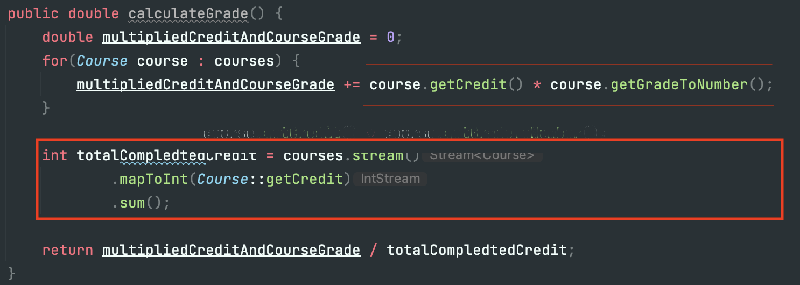
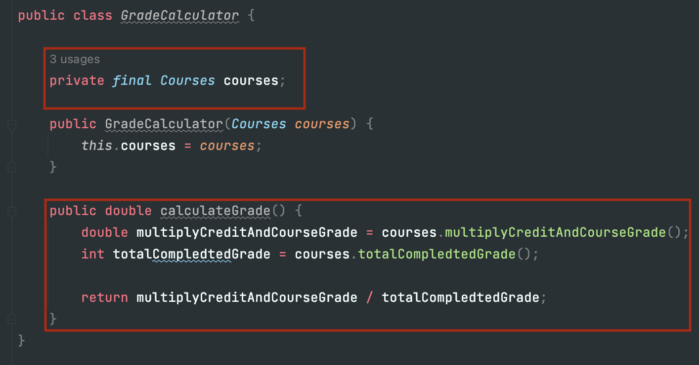
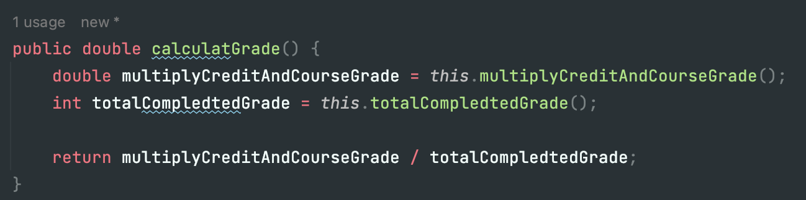
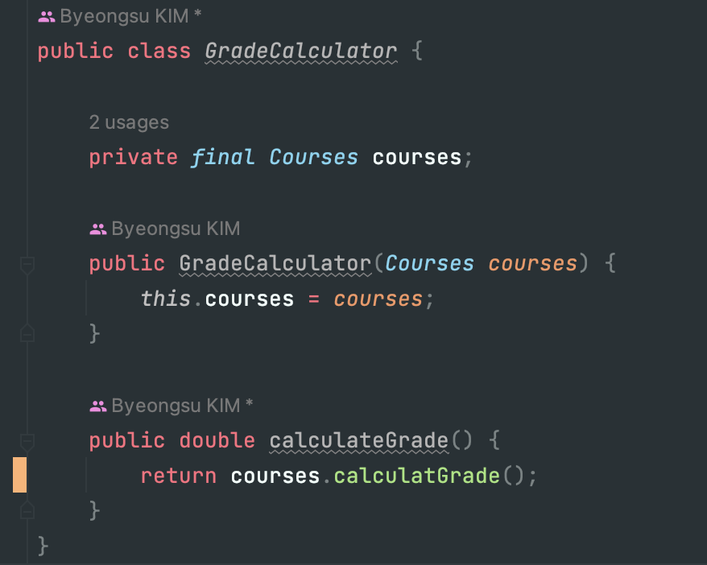

### 객체지향 실습 - 성적 계산기
다음과 같은 코드에서의 문제는 Course의 getter 메소드를 호출해서 이를 계산하고 값을 할당하고 있다는 것이다.

만약 여기서 getGradeToNumber()가 아닌 다른 메소드를 호출해야 한다거나, +1을 해야 한다는 조건이 붙게 되면 
같은 문장을 쓰고 있는 모든 메소드에서 수정을 해주어야 한다. 

이를 해결하기 위해 Course에 메소드를 만들고 호출하는 형태를 가져갈 수 있다.

 

calculateGrade()의 메소드를 보면 for문 또는 스트림을 사용하여 값을 계산하고 있는데 
이런 경우 List의 계산을 담당하는 일급 컬렉션을 이용할 수 있다. 

일급 컬렉션이란 내부에 Collection을 하나만 가지고 있는 클래스를 말한다. 다음은 List courses이외의 컬렉션을 가지지 않으며 course의 비즈니스 로직을 처리하는 메소드를 가지고 있다.

이렇게 일급 컬렉션을 이용했을 때의 장점은 무엇일까?
1. 관련이 있는 상태와 행위를 한 곳에서 관리할 수 있다.
 
totalCompletedCredit을 보면 courses의 값과 계산하는 로직은 연관성이 큰데 이를 사용하는쪽에서 계산하고 있습니다.
   
 
2. 불변을 보장한다.  
자바의 final을 사용할 수 있지만, final은 재할당만 금지한다. Map을 사용하는 경우 값을 추가할 수 있기 때문에 이를 막을 순 없지만 일급 컬렉션을 사용하는 경우 이를 방지할 수 있다.
  [참고링크](https://jojoldu.tistory.com/412)

 
수정된 코드를 보면서 일급 컬렉션이 주는 장점을 확인해보자.

값을 관리하고 있는 주체인 courses에서 비즈니스 로직도 담당하기 때문에 수정이 일어나도 courses와 관련된 작업을 하는 메소드에서는 수정이 필요하지 않다. courses의 내부 메소드만 수정하면 된다.
 
추가적으로 다음과 같은 작업도 가능하다.
  
